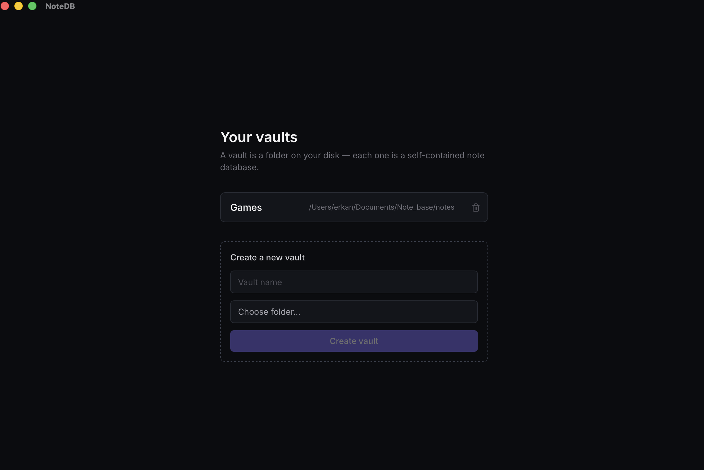
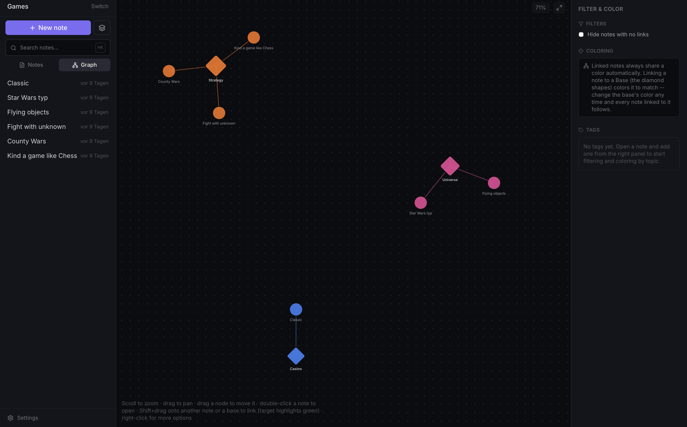
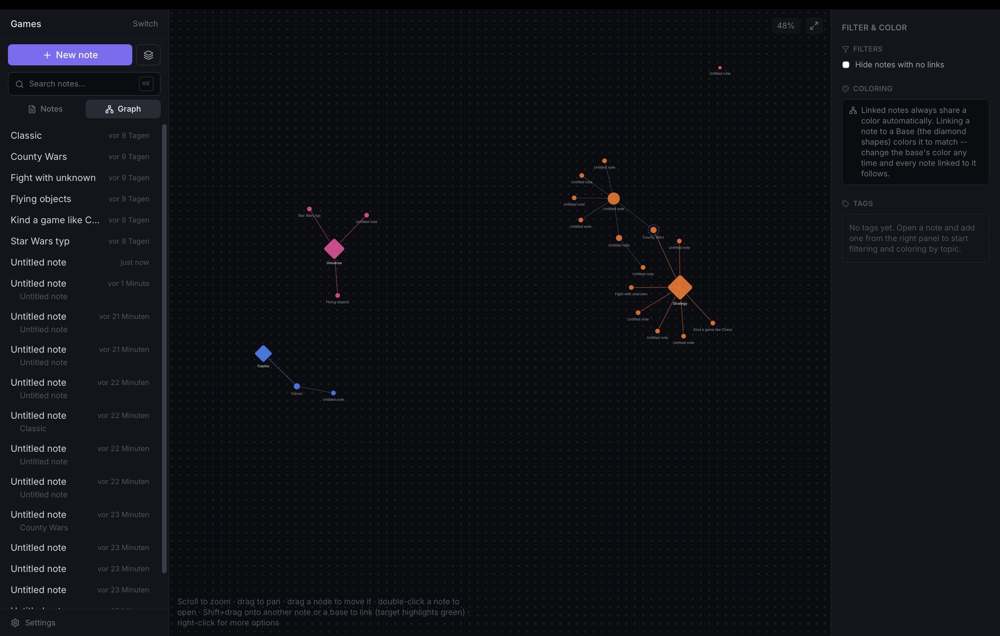

# NoteDB

NoteDB is a local-first desktop note database built with Tauri, React, Next.js, Rust, and SQLite.

Each vault is stored as a local SQLite database, so notes, links, tags, history, and graph relationships stay queryable without a cloud service. The same structure also makes the data useful for analytics, search experiments, embeddings, and machine-learning workflows.

## Features

- Local vaults stored on disk
- SQLite-backed notes, tags, links, and history
- Autosaving editor
- Wiki-style links and backlinks
- Full-text search
- Graph view for note and base relationships
- No account, sync service, or remote database required

## Why SQLite

SQLite keeps the app portable while preserving a structured data model. A vault can be inspected, backed up, queried, exported, or used as a dataset for downstream tools.

Useful downstream workflows include:

- semantic search
- embedding pipelines
- recommendation experiments
- local ML preprocessing
- graph and tag analysis

## Requirements

- Node.js 20+
- Rust 1.77+
- Tauri system dependencies for your operating system

## Development

```bash
npm install
npm run tauri dev
```

## Build

```bash
npm run tauri build
```

## Checks

```bash
npm run build
cd src-tauri
cargo test
```

## Project Structure

- `src/app` - application shell
- `src/components` - React components
- `src/lib` - shared frontend types and Tauri API wrapper
- `src-tauri/src` - Rust data layer and desktop commands
- `src-tauri/migrations` - SQLite schema migrations

## Screenshots





## License

MIT
